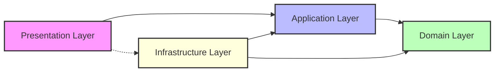
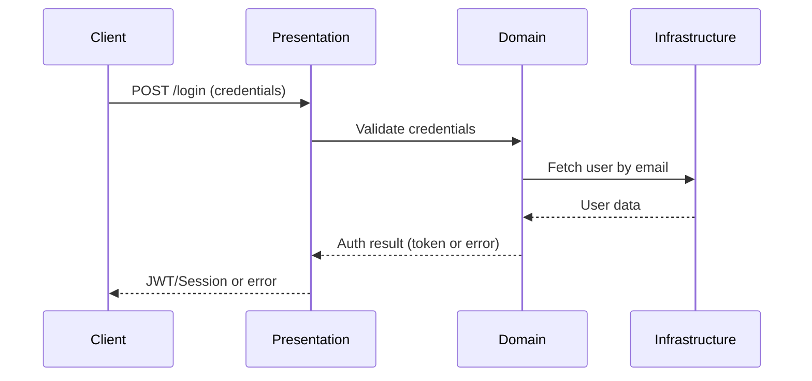

# Node.js Clean Architecture Authentication API

This project is a robust and scalable **Authentication System** built with Node.js, TypeScript, and Express, following the principles of **Clean Architecture**. It leverages [Bun](https://bun.sh) for ultra-fast development and execution, and is designed for maintainability, testability, and clear separation of concerns.

---

## ✨ Key Features

- **Clean Architecture**: Strict separation of concerns (Domain, Infrastructure, Presentation, Config).
- **TypeScript**: Static typing for reliability and maintainability.
- **Express**: Minimal and flexible HTTP API layer.
- **Environment Variables**: Centralized and validated configuration with `dotenv` and `env-var`.
- **Bun**: Lightning-fast dependency management and runtime.
- **Authentication Ready**: Foundation for secure login, registration, and token management.

---

## 📁 Project Structure

```text
├── src/
│   ├── config/           # Environment configuration
│   ├── domain/           # Business logic and core entities (authentication, users, etc.)
│   ├── infrastructure/   # External adapters (DB, services, token providers)
│   └── presentation/     # Express server and HTTP controllers
├── index.ts              # Application entry point
├── package.json          # Dependencies and scripts
├── tsconfig.json         # TypeScript configuration
└── bun.lock              # Bun lockfile
```

---

## 🧩 Clean Architecture Overview

This project implements Clean Architecture to ensure that business rules are independent of frameworks, UI, and external agencies. The dependencies always point inwards, towards the domain.

### Mermaid Diagram: Layered Architecture



### Typical Authentication Flow



---

## 🚀 Getting Started

1. **Install dependencies:**
   ```bash
   bun install
   ```

2. **Configure environment variables:**
   Create a `.env` file in the project root:
   ```env
   PORT=3100
   # Add DB_URL, JWT_SECRET, etc. as needed
   ```

3. **Run the development server:**
   ```bash
   bun run dev
   ```
   Or run the entrypoint directly:
   ```bash
   bun run index.ts
   ```

---

## 📜 Available Scripts

- `bun run dev`   — Start the server in watch/development mode.
- `bun run build` — Build the project for production (`dist/`).

---

## 🛠️ Technologies

- [Node.js](https://nodejs.org/)
- [TypeScript](https://www.typescriptlang.org/)
- [Express](https://expressjs.com/)
- [Bun](https://bun.sh/)
- [dotenv](https://www.npmjs.com/package/dotenv)
- [env-var](https://www.npmjs.com/package/env-var)

---

## 🏗️ Extending the System

- Add authentication use cases in `src/domain/` (e.g., user registration, login, password reset).
- Implement infrastructure adapters for database and token management in `src/infrastructure/`.
- Add HTTP endpoints in `src/presentation/`.

---

> Modern, robust, and scalable authentication API boilerplate with Node.js and Clean Architecture.